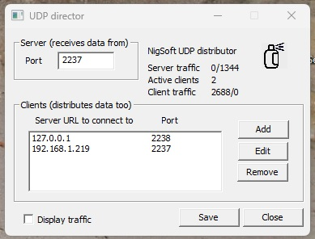

# UPD dispatcher
For ham radio FT-8 protocol I use WSJT-X, GridWatcher and some other apps
but getting the UPD feed from WSJT-X to all it's fans was a problem to me.
It doesn't do multi-cast (reasonable as it can do horrible things to a
network) but if I set up a chain any one program can knock the whole
system over. Hence I decided to write my own UPD dispatcher that is a host
and takes in all the WSJT-X messages and then posts them off as a group of
clients to all the users and if any one of them stops responding it just
retries (every 5 seconds) it until it comes back.

I run it on the same PC as WSJT-X and Gridwatcher so it is set to receive
on port 2237, which is the WSJT-X default, and it relays the messages to
Gridwatcher on 127.0.0.1:2238, so that needs re-configuring, and I have
another device on my home network at 192.169.1.219:2237. See the screenshot
below.

It was a bit messy to relearn ol' WebSockets again after so many years but
it works now. The transaction viewer is deliberatly simple-minded. It just
displays the ascii characters and collapses any number of non-ascii ones
into a singe dot. It works enough to test that the system is moving the
right stuff. It is not intended to be WSJT-X specific and will take any
old UDP stream and honest broker it onwards...

It does simple reverse messaging, taking any messages from the hosts and
pumping them back to the original client, but there is no sense in which
it provides separate identities or even ordering.

It is fully multi-threaded with thread safe queues so all the sub-systems
run independently and sequentially.

It saves its configuration file in your 'roaming' folder so it is reasonably
portable.

I made it remember its place on the screen to fall in with the radio apps
but it could just as well be setup to start minimised.

It seems to work OK and you can switch the radio apps in and out at will and
within a few seconds they are back up and running again.

I have added 'reader' that can be set up as another host and will dump certain
WSJT-X packets to a text file. It is intended as a cut-and-stick source for
things that would use those packets to do something useful for me. Currently
it is coded to read from port 2239 but I'll sort out that later...

I also put two powershall scripts in the 'Other FT-8 items' folder.
ft-8.ps1 is run by an icon on my desktop to start the system up and that also
starts off ft-8-mod.ps1 that watches for the 'Log QSO' window and goes 'Bong'
so I don't miss anything when calling CQ into the darkness. include.ps1 is dot
included into my $profile to provide the extra PowerShell functions I want.

The .msi file contains Dispatcher and reader and is tested on current Windows 11.

Usual disclaimers apply. Use at your own risk. May cause cancer in rats.