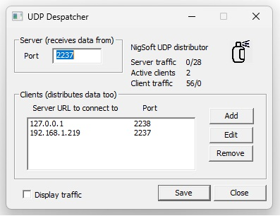

# UPD dispatcher
For ham radio FT-8 protocol I use WSJT-X, GridWatcher and some other apps
but getting the UPD feed to all of them was always a problem to me. It doesn't
do multi-cast (reasonable as it can do horrible things to a network) but if
I set up a chain any one program can knock the whole system over. Hence I
decided to write my own UPD dispatcher that takes in the WSJT-X messages
and posts them off to all the users and if any one of them stops responding
it just retries (every 5 seconds) it until it comes back.

I run it on the same PC as WSJXT-X and Gridwatcher so it is set to receive
on port 2237, which is the WSJT-X default, and it relays the messages to
Gridwatcher on 127.0.0.1:2238, so that needs re-configuring, and I have
another device on my home network at 192.169.1.219:2237. See the screenshot
below.

It was a bit messy to relearn ol' WebSockets again after so many years but
it works now. I might add a more sensible transaction viewer later but that
will involve unpacking the UDP packets and that would make things specific
to these programs while at the moment I just takes any old UDP stream and
honest broker it onwards... For logging I only display the ascii characters
and collapse any number of non-ascii ones into a singe dot. It works enough
to test the system is moving the right stuff

It does do reverse messaging taking any messages from the hosts and pumping
them back to the original client but there is no sense in which it provides
separate identities or ordering.

It is fully multi-threaded with thread safe queues so all the sub-systems
run independently and sequentially.

It saves its configuration file in your 'roaming' folder so it is reasonably
portable.

I made it remember its place on the screen to fall in with the radio apps
but it could just as well be setup to start minimised.

It seems to work OK and you can switch the radio apps in and out at will and
within a few seconds everything is back up and running again.

Usual disclaimers apply. Use at your own risk. May cause cancer in rats.